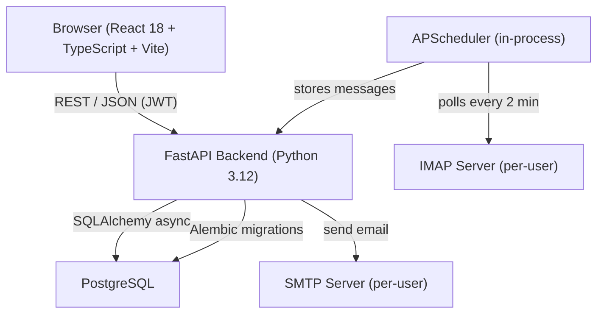
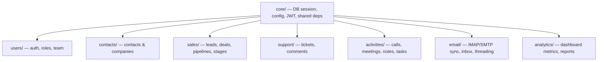
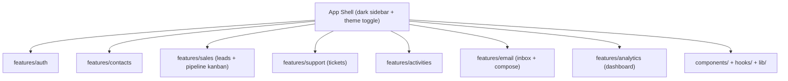
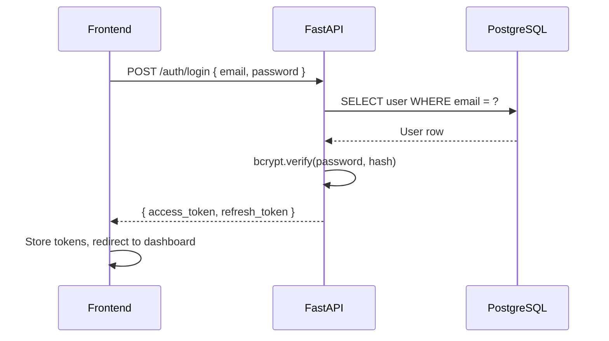
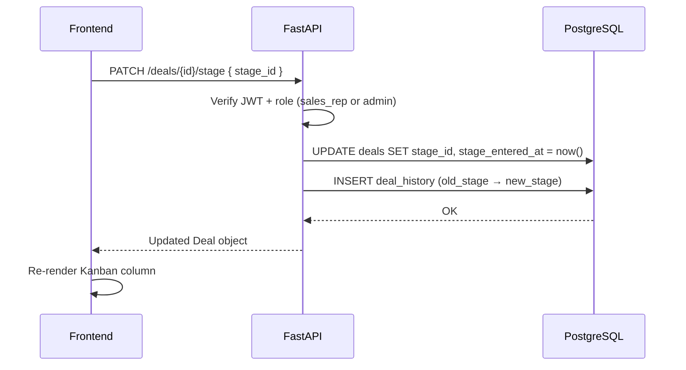
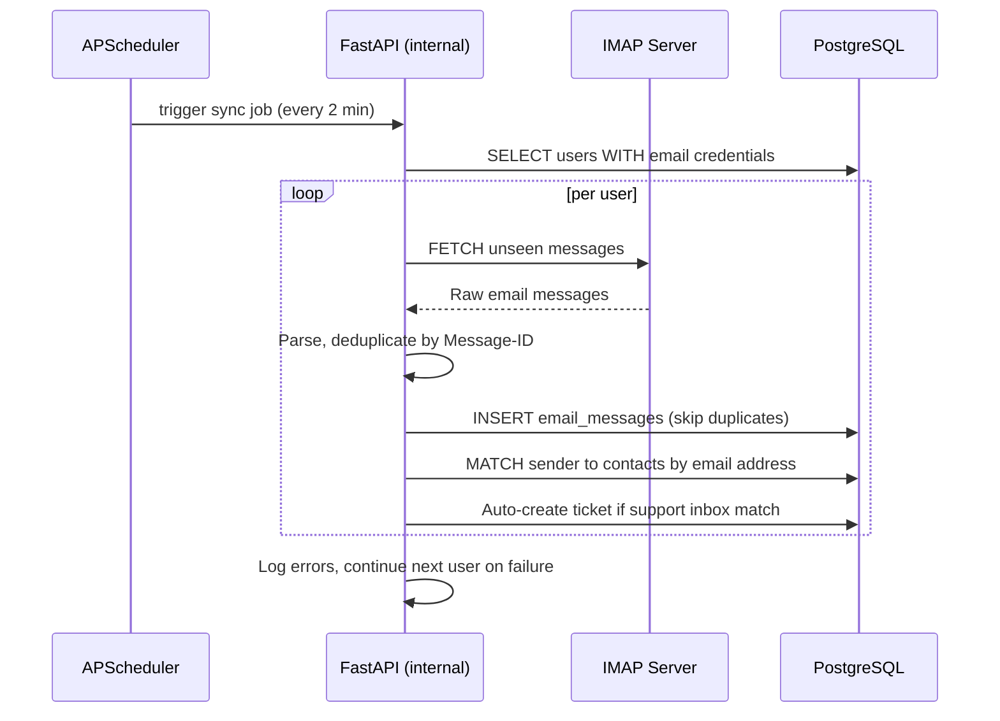
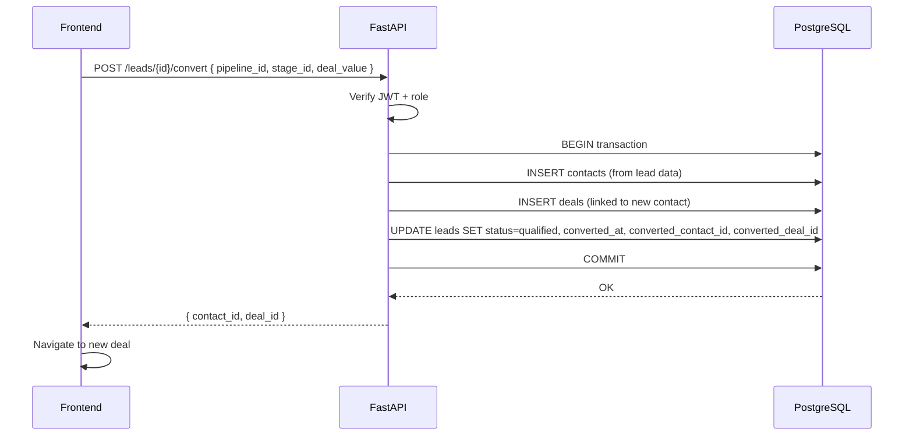

# Design Document: CRM System

## Overview

A fully featured, single-company CRM covering sales pipeline management, customer support ticketing, and general contact/company management. Built for a single organization with multiple users across different roles (admin, sales_rep, support_agent, viewer).

The system is a modular monolith: one deployed FastAPI process with clearly separated Python packages per domain, paired with a React 18 + TypeScript frontend. Email sync runs as an in-process APScheduler job polling IMAP every 2 minutes. All data lives in a single PostgreSQL database accessed via SQLAlchemy async.

## Architecture

### System Overview



### Backend Module Structure



### Frontend Feature Structure



## Components and Interfaces

### Backend Domain Modules

Each domain module exposes an APIRouter mounted in the main FastAPI app. Role checks are enforced via FastAPI dependencies injected per route.

#### users/
**Purpose**: Authentication, JWT lifecycle, role management, team listing.

**Interface**:
```
POST   /auth/register
POST   /auth/login          → { access_token, refresh_token }
POST   /auth/refresh
POST   /auth/logout
POST   /auth/password-reset/request
POST   /auth/password-reset/confirm
GET    /users/              → list team members (admin only)
PATCH  /users/{id}/role     → assign role (admin only)
```

#### contacts/
**Purpose**: Full CRUD for contacts and companies, search/filter, merge duplicates, timeline view.

**Interface**:
```
GET/POST        /contacts/
GET/PATCH/DELETE /contacts/{id}
POST            /contacts/{id}/merge
GET             /contacts/{id}/timeline
GET/POST        /companies/
GET/PATCH/DELETE /companies/{id}
```

#### sales/
**Purpose**: Leads lifecycle, deal management, pipeline and stage configuration, Kanban board data.

**Interface**:
```
GET/POST         /leads/
GET/PATCH/DELETE /leads/{id}
POST             /leads/{id}/convert       → creates Contact + Deal
GET/POST         /pipelines/
GET/PATCH/DELETE /pipelines/{id}
GET/POST         /pipelines/{id}/stages
PATCH            /stages/{id}
GET/POST         /deals/
GET/PATCH/DELETE /deals/{id}
PATCH            /deals/{id}/stage         → moves deal, records history
POST             /deals/{id}/won
POST             /deals/{id}/lost
```

#### support/
**Purpose**: Ticket creation, assignment, status workflow, threaded comments.

**Interface**:
```
GET/POST         /tickets/
GET/PATCH/DELETE /tickets/{id}
PATCH            /tickets/{id}/status
PATCH            /tickets/{id}/assign
GET/POST         /tickets/{id}/comments
```

#### activities/
**Purpose**: Polymorphic activity records linked to contacts, deals, or tickets.

**Interface**:
```
GET/POST         /activities/
GET/PATCH/DELETE /activities/{id}
GET              /activities/feed          → recency-sorted across all entities
```

#### email/
**Purpose**: Per-user IMAP/SMTP credentials, inbox sync, thread view, compose/reply.

**Interface**:
```
POST   /email/credentials              → save encrypted IMAP/SMTP config
GET    /email/inbox                    → paginated thread list
GET    /email/threads/{id}
POST   /email/send
POST   /email/reply/{thread_id}
PATCH  /email/threads/{id}/link        → link thread to contact/deal/ticket
```

#### analytics/
**Purpose**: Aggregated KPI metrics and chart data with date range filtering.

**Interface**:
```
GET /analytics/kpis?range=7d|30d|90d|custom&from=&to=
GET /analytics/pipeline-funnel?pipeline_id=&range=
GET /analytics/sales-velocity?pipeline_id=&range=
GET /analytics/ticket-resolution?range=
GET /analytics/activity-breakdown?range=
```

### Frontend Components

| Component | Purpose |
|---|---|
| `AppShell` | Dark sidebar navigation, theme toggle, user menu |
| `KanbanBoard` | Drag-and-drop deal cards across pipeline stages |
| `ContactTimeline` | Chronological feed of activities, emails, deals, tickets |
| `EmailInbox` | Thread list + thread detail + compose/reply panel |
| `AnalyticsDashboard` | KPI cards + chart grid with date range picker |
| `TicketDetail` | Status workflow controls + threaded comment list |
| `LeadConvertModal` | One-action lead → Contact + Deal conversion |

## Data Models

### Users & Roles

```typescript
interface User {
  id: UUID
  email: string
  full_name: string
  role: "admin" | "sales_rep" | "support_agent" | "viewer"
  is_active: boolean
  created_at: datetime
}
```

### Contacts & Companies

```typescript
interface Company {
  id: UUID
  name: string
  website?: string
  industry?: string
  owner_id: UUID          // User
  created_at: datetime
}

interface Contact {
  id: UUID
  first_name: string
  last_name: string
  email: string
  phone?: string
  company_id?: UUID       // Company
  owner_id: UUID          // User
  tags: string[]
  created_at: datetime
}
```

### Leads

```typescript
interface Lead {
  id: UUID
  name: string
  email: string
  source?: string
  status: "new" | "contacted" | "qualified" | "disqualified"
  owner_id: UUID
  created_at: datetime
  converted_at?: datetime
  converted_contact_id?: UUID
  converted_deal_id?: UUID
}
```

### Deals, Pipelines & Stages

```typescript
interface Pipeline {
  id: UUID
  name: string
  is_default: boolean
}

interface Stage {
  id: UUID
  pipeline_id: UUID
  name: string
  position: integer        // ordering
}

interface Deal {
  id: UUID
  title: string
  value: decimal
  currency: string
  pipeline_id: UUID
  stage_id: UUID
  stage_entered_at: datetime
  expected_close_date?: date
  status: "open" | "won" | "lost"
  won_lost_reason?: string
  contact_id?: UUID
  company_id?: UUID
  owner_id: UUID
  created_at: datetime
}

interface DealHistory {
  id: UUID
  deal_id: UUID
  changed_by: UUID
  field: string
  old_value: string
  new_value: string
  changed_at: datetime
}
```

### Support Tickets & Comments

```typescript
interface Ticket {
  id: UUID
  subject: string
  description: string
  status: "open" | "in_progress" | "resolved" | "closed"
  priority: "low" | "medium" | "high" | "urgent"
  contact_id?: UUID
  assigned_to?: UUID      // User
  created_by: UUID
  created_at: datetime
  resolved_at?: datetime
}

interface TicketComment {
  id: UUID
  ticket_id: UUID
  author_id: UUID
  body: string
  created_at: datetime
}
```

### Activities (Polymorphic)

```typescript
interface Activity {
  id: UUID
  type: "call" | "meeting" | "note" | "task" | "email_logged"
  subject: string
  body?: string
  due_at?: datetime
  completed_at?: datetime
  owner_id: UUID
  // polymorphic links — at most one set
  contact_id?: UUID
  deal_id?: UUID
  ticket_id?: UUID
  created_at: datetime
}
```

### Email Threads & Messages

```typescript
interface EmailThread {
  id: UUID
  subject: string
  last_message_at: datetime
  // optional CRM links
  contact_id?: UUID
  deal_id?: UUID
  ticket_id?: UUID
}

interface EmailMessage {
  id: UUID
  thread_id: UUID
  message_id: string      // RFC 2822 Message-ID
  from_address: string
  to_addresses: string[]
  cc_addresses: string[]
  body_text: string
  body_html?: string
  sent_at: datetime
  direction: "inbound" | "outbound"
  owner_id: UUID          // which user's mailbox
}

interface EmailCredential {
  id: UUID
  user_id: UUID
  imap_host: string
  imap_port: integer
  smtp_host: string
  smtp_port: integer
  username: string
  password_encrypted: string   // Fernet-encrypted
}
```

## Sequence Diagrams

### User Login Flow



### Deal Stage Move (Kanban Drag)



### Email Sync Cycle



### Lead Conversion



## Roles & Permissions

| Action | admin | sales_rep | support_agent | viewer |
|---|---|---|---|---|
| Manage users & roles | ✅ | ❌ | ❌ | ❌ |
| Full contact/company CRUD | ✅ | ✅ | ✅ | read |
| Leads | ✅ | ✅ | read | read |
| Deals & pipelines | ✅ | ✅ | read | read |
| Support tickets | ✅ | read | ✅ | read |
| Activities | ✅ | ✅ | ✅ | read |
| Email (own mailbox) | ✅ | ✅ | ✅ | ❌ |
| Analytics | ✅ | ✅ | ✅ | ✅ |

Role checks are enforced via FastAPI dependency injection on every route handler, not just at the router level.

## Error Handling

### API Error Format

All errors return a consistent JSON envelope:

```json
{ "error": "<type>", "detail": "<human-readable message>" }
```

| Status | Condition | Example detail |
|---|---|---|
| 401 | Missing or expired JWT | "Authentication required" |
| 403 | Insufficient role | "sales_rep cannot manage users" |
| 404 | Resource not found | "Deal 123 not found" |
| 422 | Validation error | FastAPI default, standardized |
| 500 | Unexpected server error | "Internal server error" (logged server-side) |

### Email Sync Errors

APScheduler catches all exceptions per-user sync cycle. Errors are logged with user ID and timestamp. The scheduler continues to the next user and retries on the next 2-minute cycle. Sync errors never propagate to the API request/response cycle.

### Frontend Error Handling

- API errors → toast notifications (react-hot-toast or shadcn/ui Toast)
- Form validation errors → inline field-level messages
- Network failures → retry prompt or offline indicator

## Testing Strategy

### Backend (pytest + httpx)

- Async test client via `httpx.AsyncClient` against a real PostgreSQL test database (Docker Compose)
- Each domain module has a `tests/` folder mirroring module structure
- Fixtures: seeded users per role, contacts, deals, tickets, pipelines
- Key test areas: auth flows, role enforcement on every route, deal stage transitions, lead conversion atomicity, email deduplication

### Frontend (Vitest + React Testing Library)

- Unit tests for shared components (Button, Modal, Table, KanbanCard)
- Unit tests for custom hooks (useAuth, useDeals, useContacts)
- Integration tests for key flows: create contact, move deal between stages, close ticket, compose email

### E2E (Playwright)

Critical paths:
- Login / logout
- Create a deal and drag it through all pipeline stages
- Create and close a support ticket with comments
- Send an email from within the CRM

### Property-Based Testing

**Library**: hypothesis (Python backend)

Key properties to verify:
- Lead conversion is atomic: either both Contact and Deal are created or neither is
- Deal history always reflects every stage transition
- Email deduplication: inserting the same Message-ID twice results in exactly one record
- Role permission matrix: for every (role, action) pair, access is granted or denied consistently

## Performance Considerations

- SQLAlchemy async sessions prevent blocking the FastAPI event loop during DB queries
- Email sync runs in a background scheduler thread — isolated from API request handling
- Analytics queries use date-range filters and should be backed by indexes on `created_at` / `stage_entered_at` / `resolved_at` columns
- Kanban board loads deals per pipeline in a single query with stage grouping; pagination applied when deal count exceeds 200 per stage
- Frontend uses React Query (TanStack Query) for server state caching and background refetch

## Security Considerations

- JWT access tokens short-lived (15 min); refresh tokens longer-lived (7 days), stored in httpOnly cookies
- Passwords hashed with bcrypt (cost factor ≥ 12)
- Per-user IMAP/SMTP credentials encrypted at rest with Fernet symmetric encryption; encryption key stored as `EMAIL_ENCRYPTION_KEY` env var, never in DB
- Role checks enforced server-side on every route — frontend role gating is UX only
- All secrets (`DATABASE_URL`, `JWT_SECRET`, `EMAIL_ENCRYPTION_KEY`) loaded from environment variables, never hardcoded
- CORS configured to allow only the frontend origin in production

## Dependencies

### Backend

| Package | Purpose |
|---|---|
| fastapi | Web framework |
| sqlalchemy[asyncio] | Async ORM |
| alembic | DB migrations |
| asyncpg | Async PostgreSQL driver |
| pydantic v2 | Request/response validation |
| python-jose | JWT encode/decode |
| bcrypt | Password hashing |
| cryptography | Fernet encryption for email credentials |
| apscheduler | In-process email sync scheduler |
| httpx | Async HTTP client (also used in tests) |
| pytest + pytest-asyncio | Test framework |
| hypothesis | Property-based testing |

### Frontend

| Package | Purpose |
|---|---|
| react 18 + typescript | UI framework |
| vite | Build tool / dev server |
| tailwindcss | Utility-first CSS |
| shadcn/ui | Component library |
| @tanstack/react-query | Server state management |
| @dnd-kit/core | Drag-and-drop for Kanban |
| react-router-dom v6 | Client-side routing |
| react-hook-form + zod | Form handling + validation |
| vitest + @testing-library/react | Unit / integration tests |
| playwright | E2E tests |

### Infrastructure

| Tool | Purpose |
|---|---|
| Docker Compose | Local dev orchestration (postgres, backend, frontend) |
| PostgreSQL 16 | Primary database |
| `.env` file | Secrets: DATABASE_URL, JWT_SECRET, EMAIL_ENCRYPTION_KEY |

## Correctness Properties

*A property is a characteristic or behavior that should hold true across all valid executions of a system — essentially, a formal statement about what the system should do. Properties serve as the bridge between human-readable specifications and machine-verifiable correctness guarantees.*

### Property 1: Invalid credentials always produce 401

*For any* combination of email and password where the password does not match the stored hash for that email, the login endpoint SHALL return a 401 response.

**Validates: Requirement 1.3**

---

### Property 2: Stored passwords are bcrypt-hashed with cost ≥ 12

*For any* user registration with any password string, the value stored in the database SHALL be a valid bcrypt hash with a cost factor of at least 12, never the plaintext password.

**Validates: Requirement 1.7**

---

### Property 3: Non-admin role enforcement on admin-only routes

*For any* request made by a User whose role is sales_rep, support_agent, or viewer, any attempt to access an admin-only route (user list, role change, pipeline/stage mutation) SHALL return a 403 response.

**Validates: Requirements 3.3, 10.5**

---

### Property 4: Contact creation round-trip

*For any* valid contact payload (first name, last name, email), creating a Contact and then fetching it by the returned ID SHALL produce a record whose fields match the submitted payload.

**Validates: Requirements 4.1, 4.2**

---

### Property 5: Contact update is reflected on read

*For any* existing Contact and any valid partial-update payload, after a successful PATCH the GET response for that Contact SHALL reflect all updated fields.

**Validates: Requirement 4.3**

---

### Property 6: Search/filter returns only matching contacts

*For any* filter predicate applied to the contacts endpoint, every Contact in the response SHALL satisfy all supplied filter criteria, and no Contact that fails any criterion SHALL appear in the response.

**Validates: Requirement 4.7**

---

### Property 7: Viewer cannot mutate contacts, companies, leads, or deals

*For any* resource (Contact, Company, Lead, Deal) and any mutating operation (create, update, delete), a request made by a Viewer SHALL return a 403 response.

**Validates: Requirements 4.5, 8.3, 11.3**

---

### Property 8: Contact merge preserves all associated records

*For any* two Contacts each with associated Activities, Deals, Tickets, and EmailThreads, after a successful merge the target Contact SHALL be linked to all records that were previously linked to either Contact, and the source Contact SHALL no longer exist (404 on lookup).

**Validates: Requirements 6.1, 6.2**

---

### Property 9: Contact timeline is chronologically ordered and complete

*For any* Contact with associated Activities, EmailThreads, Deals, and Tickets, the timeline response SHALL contain all associated records and SHALL be sorted in ascending chronological order by their respective timestamp fields.

**Validates: Requirement 7.1**

---

### Property 10: Newly created leads always have status `new`

*For any* valid lead creation payload submitted by a Sales_Rep or Admin, the created Lead SHALL have status `new` regardless of any other field values in the payload.

**Validates: Requirement 8.1**

---

### Property 11: Lead conversion atomicity

*For any* valid lead-conversion request, the operation SHALL be atomic: either a Contact is created, a Deal is created, and the Lead is updated to `qualified` — or none of these changes are persisted. There SHALL never be a state where only a subset of the three mutations is committed.

**Validates: Requirements 9.1, 9.2**

---

### Property 12: Pipeline stages are ordered by position

*For any* Pipeline, the stages returned by the API SHALL be ordered by their `position` field in ascending order, and after any position update the ordering SHALL remain consistent with the updated position values.

**Validates: Requirements 10.2, 10.3**

---

### Property 13: Newly created deals always have status `open`

*For any* valid deal creation payload submitted by a Sales_Rep or Admin, the created Deal SHALL have status `open` regardless of any other field values in the payload.

**Validates: Requirement 11.1**

---

### Property 14: Deal stage transition records history

*For any* Deal and any valid stage-move request, after the move the Deal's `stage_id` SHALL equal the requested stage, `stage_entered_at` SHALL be updated to the current timestamp, and a DealHistory record SHALL exist capturing the previous stage, the new stage, the acting User, and the timestamp.

**Validates: Requirements 12.1, 12.2**

---

### Property 15: Newly created tickets always have status `open`

*For any* valid ticket creation payload submitted by a Support_Agent or Admin, the created Ticket SHALL have status `open` regardless of any other field values in the payload.

**Validates: Requirement 14.1**

---

### Property 16: Viewer and Sales_Rep cannot mutate tickets

*For any* Ticket and any mutating operation (create, update, status change, assignment, comment), a request made by a Viewer or Sales_Rep SHALL return a 403 response.

**Validates: Requirement 14.3**

---

### Property 17: Ticket comments are returned in chronological order

*For any* Ticket with multiple TicketComments, the comment list response SHALL return all comments sorted by `created_at` in ascending order.

**Validates: Requirement 17.2**

---

### Property 18: Email deduplication by Message-ID (idempotence)

*For any* EmailMessage with a given RFC 2822 Message-ID, inserting that message any number of times SHALL result in exactly one EmailMessage record in the database with that Message-ID.

**Validates: Requirement 21.2**

---

### Property 19: Inbound email auto-links to matching contact

*For any* inbound EmailMessage whose `from_address` matches the `email` field of an existing Contact, the EmailThread containing that message SHALL have its `contact_id` set to the matching Contact's ID.

**Validates: Requirement 21.3**

---

### Property 20: Sync error isolation

*For any* set of Users with email credentials where one User's IMAP sync raises an exception, the sync cycle SHALL still complete for all other Users and SHALL NOT propagate the exception to the API request/response cycle.

**Validates: Requirements 21.4, 21.5**

---

### Property 21: Inbox threads sorted by last_message_at descending

*For any* User's inbox with multiple EmailThreads, the paginated inbox response SHALL return threads sorted by `last_message_at` in descending order.

**Validates: Requirement 22.1**

---

### Property 22: Email thread messages in chronological order

*For any* EmailThread with multiple EmailMessages, the thread detail response SHALL return all messages sorted by `sent_at` in ascending order.

**Validates: Requirement 22.2**

---

### Property 23: Viewer cannot access email features

*For any* email endpoint (inbox, thread detail, send, reply, link), a request made by a Viewer SHALL return a 403 response.

**Validates: Requirement 22.6**

---

### Property 24: Activity breakdown counts sum to total

*For any* date range, the sum of per-type counts returned by the activity breakdown endpoint SHALL equal the total number of Activities with `created_at` within that date range.

**Validates: Requirement 23.5**

---

### Property 25: Pipeline funnel covers all stages

*For any* Pipeline and date range, the pipeline funnel response SHALL contain an entry for every Stage in that Pipeline, including stages with zero deals.

**Validates: Requirement 23.2**

---

### Property 26: All API error responses use the standard envelope

*For any* request that results in an error (4xx or 5xx), the response body SHALL conform to the JSON schema `{ "error": string, "detail": string }` with no additional required fields.

**Validates: Requirement 24.1**

---

### Property 27: Email credential passwords are always encrypted at rest

*For any* EmailCredential save or update operation with any password string, the value stored in the `password_encrypted` column SHALL be a valid Fernet token and SHALL NOT equal the plaintext password.

**Validates: Requirements 20.1, 26.5**
